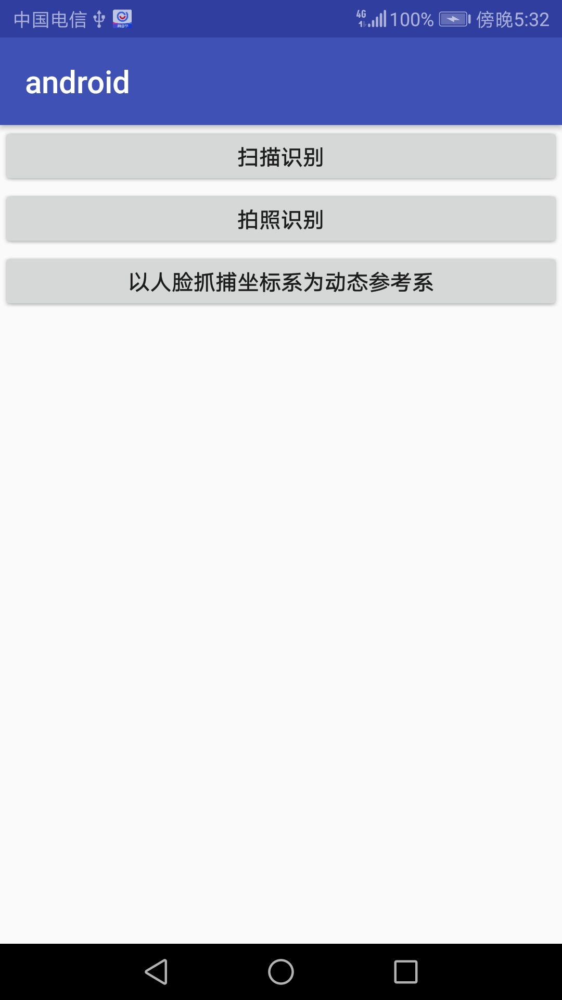
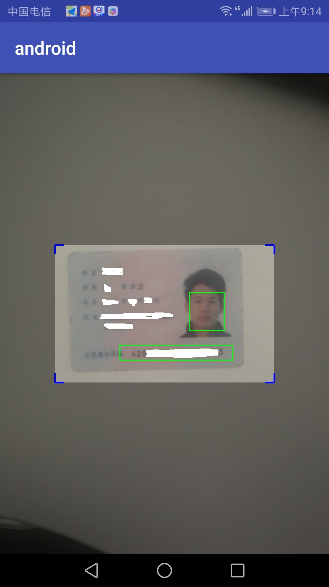
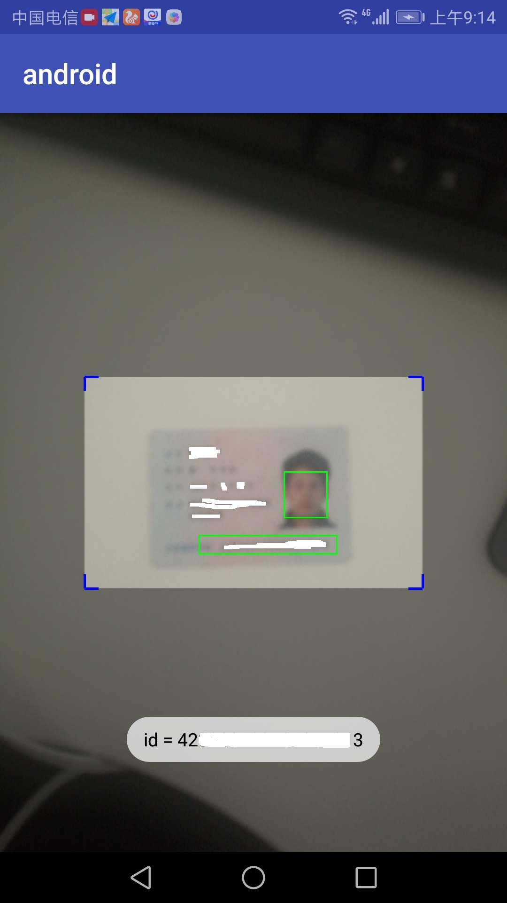

## OCR识别Demo ##
  
	

> 一个基于tess-two实现的Android二代身份证识别demo，实现方式包括固定点分割、动态分割两种形式。

##1. 基于固定点分割

> 该种实现原理比较简单，在UI视图上绘制一个选框，用户将证件号码区域对齐该选框，程序将提取选框内的图片，然后基于tess-two识别该图片内容。

##2. 基于人脸坐标为参考系的动态分割

> 该种实现原理稍复杂些，通过原生Android的人脸检测，定位出人脸位置，以该位置为参考系，计算出证件号码区域，然后提取该区域图片，基于tess-two识别该图片。

- 效果图：

